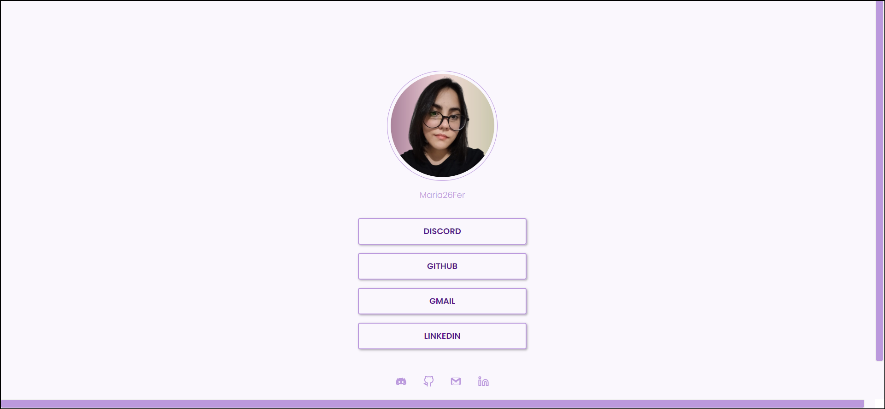

<h1 align="center"> Projeto Social Tree </h1>

 

  

 
 
## 💻 Projeto
---
Este é um projeto de uma lista de links que podem ser usadas em perfis de redes sociais.

 

## 👩‍💻 Tecnologias
---
- HTML
- CSS
- Git e Github

 

## 🏷️ Layout
---
Você pode visualizar o layout do projeto através [desse link](https://www.figma.com/file/sJtspSJca4In62seBg8qVY/Social-Tree-%E2%80%A2-Desafio-Discover-(Community)?type=design&node-id=113-4&t=59JAWnseG4Fl2v0U-0).

 

## 🚀 Créditos
---
### 💜 Desafios [discover](https://efficient-sloth-d85.notion.site/b0b109c64d0a4a8eb4de547de18fa04d?v=dd9d2f6b0f6542d69807f41312f4116d) rocketseat: **Social Tree**.